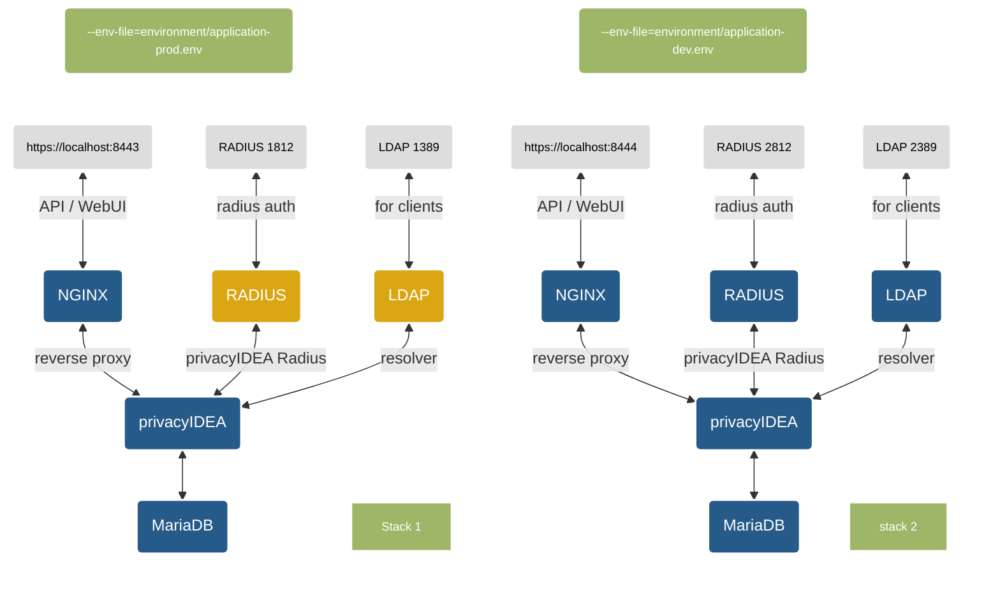

[](https://github.com/gpappsoft/privacyidea-docker/actions/workflows/docker-publish.yml)

[](https://img.shields.io/docker/pulls/gpappsoft/privacyidea-docker)

# privacyIDEA-docker

Simply deploy and run a privacyIDEA instance in a container environment. 

> [!Important]
> #### The base-image changed from ``python-slim`` to [Wolfi OS](https://github.com/wolfi-dev). 
> The old approach is still available in the ```python-slim``` Branch.

## Overview 
[privacyIDEA](https://github.com/privacyidea/privacyidea) is an open solution for strong two-factor authentication like OTP tokens, SMS, smartphones or SSH keys. 

This project is a complete build environment under linux to build and run privacyIDEA in a container environment. It uses the [Wolfi OS](https://github.com/wolfi-dev) image and the official [privacyIDEA-Project](https://pypi.org/project/privacyIDEA/)  from PyPi. The image uses [gunicorn](https://gunicorn.org/) from PyPi to run the app. 

**The main goals of this project are to:**
- Give an idea how to run privacyIDEA in a container.
- Build and run the container image, simple and fast.
- Deploy different versions and/or stages (e.g. production, staging, devel ...) with the same or different configuration on the same host.
- Easy deploy a "full-stack" (e.g. privacyIDEA, radius, database and reverse proxy) with docker compose.
- Keep the container's image simple, slim and secure.
- To build images with no changes to the original privacyIDEA code and as less as possible additional scripts as possible inside the image to run the container. 

**What this project is not:**
- A fully tested and "production-ready" installation of privacyIDEA for *your* container environment.
- A possible way to ignore the [privacyIDEA Documentation](https://privacyidea.readthedocs.io/en/latest/)
- A guide on how to use docker
- A guid how to configure and use privacyIDEA 

> [!Important] 
> The image does **not include** a reverse proxy or a database backend. Running the default image as a standalone container uses gunicorn and a sqlite database. Using sqlite is not suitable for a production environment.
>
> A more 'real-world' scenario, which is often used, is described in the [Compose a privacyIDEA stack](#compose-a-privacyidea-stack) section.
>
> Also check the [Security considerations](#security-considerations) before running the image or stack in a production environment.

**While decoupling the privacyIDEA image from dependencies like Nginx, Apache or database vendors ect., it is possible to run privacyIDEA with your favorite components.**

If you prefer another approach or would like to test another solution, take a look at the [Khalibre / privacyidea-docker](https://github.com/kheeklab/privacyidea-docker) project. This project might be a more suitable solution for your needs.


### tl;dr 
Clone repository and start a full privacyIDEA stack: 
```
git clone https://github.com/gpappsoft/privacyidea-docker.git
cd privacyidea-docker
make cert fullstack
```


## Repository 

| Directory | Description |
|-----------|-------------|
| *conf* | contains *pi.cfg* and *logging.cfg* files which is included in the image build process.|
| *environment* | contains different example-environment files for a whole stack via docker compose|
| *scripts* | contains custom scripts for the privacyIDEA script-handler. The directory will be mounted into the container when composing a [stack](#compose-a-privacyidea-stack). Scripts must be executable (chmod +x)|
|*templates*| contains files used for different services (nginx, radius ...) and also contains the ssl certificate for the reverse-proxy. Replace it with your own certificate and key file. Use PEM-Format without a passphrase. \*.pfx is not supported. Name must be ***pi.pem*** and ***pi.key***. ||


## Images
Sample images from this project can be found here: 
| registry | repository |
|----------|------------|
| [docker.io](https://hub.docker.com/r/gpappsoft/privacyidea-docker)|```docker pull docker.io/gpappsoft/privacyidea-docker:latest```
| [ghcr.io](https://github.com/gpappsoft/privacyidea-docker/pkgs/container/privacyidea-docker)| ```docker pull ghcr.io/gpappsoft/privacyidea-docker:latest```|

> [!Note] 
> ```latest``` tagged image is maybe a pre- or development-release. Please use always a release number (like ```3.10.0.1```) 


## Quickstart

### Prerequisites and requirements

- Installed a container runtime engine (docker / podman).
- Installed [BuildKit](https://docs.docker.com/build/buildkit/), [buildx](https://github.com/docker/buildx) and [Compose V2](https://docs.docker.com/compose/install/linux/) (docker-compose-v2) components
- The repository is tested with versions listed in [COMPAT.md](COMPAT.md)
- [Podman](https://podman.io) is partially supported. **Please refer to [PODMAN.md](PODMAN.md) for more details.**

#### Quick & Dirty

```
docker pull docker.io/gpappsoft/privacyidea-docker:latest
			-p 8080:8080 \
			gpappsoft/privacyidea-docker:latest

```
Web-UI: http://localhost:8080

User/password: **admin**/**admin**

#### Preferred way

To build and run a simple local privacyIDEA container (which can run standalone with sqlite):

```
git clone https://github.com/gpappsoft/privacyidea-docker.git
cd privacyidea-docker
make cert build push run
....
```

##### Accessing the Web-UI:
Use https://localhost:8080

Default admin username: **admin** 

Default admin password: **admin**


## Build images

You can use *Makefile* targets to build different images with different privacyIDEA versions.

#### Build a specific privacyIDEA version
```
make build PI_VERSION=3.10.0.1
```

#### Push to a registry
Use ```make push [REGISTRY=<registry>]```to tag and push the image[^1]
##### Example 
Push image to local registry on port 5000[^2]

```
make push REGISTRY=localhost:5000
``` 

#### Remove the container:
```
make clean
```
You can start the container with the same database (sqlite) and configuration and use ```make run``` again without bootstrapping the instance.
#### Remove the container including volumes:
```
make distclean
```
&#9432; This will wipe the whole container including the volumes!

## Overview ```make``` targets

| target | optional ARGS | description | example
---------|----------|---|---------
| ```build ``` | ```PI_VERSION```<br> ```IMAGE_NAME```|Build an image. Optional: specify the version and image name| ```make build PI_VERSION=3.10```|
| ```push``` | ```REGISTRY```|Tag and push the image to the registry. Optional: specify the registry URI. Defaults to *localhost:5000*| ```make push REGISTRY=docker.io/gpappsoft/privacyidea-docker```|
| ```run``` |  ```PORT``` <br> ```TAG```  |Run a standalone container with gunicorn and sqlite. Optional: specify the prefix tag of the container name and listen port. Defaults to *pi* and port *8080*| ```make run TAG=prod PORT=8888```|
| ```secret``` | |Generate secrets to use in an environment file | ```make secret```|
| ```cert``` | |Generate a self-signed certificate for the reverse proxy container in *./templates* and **overwrite** the existing one | ```make cert```|
| ```stack``` |```TAG``` ```PROFILE```| Run a whole stack with the environment file *environment/application-*```TAG```*.env*. Default is *prod*. Possible ```PROFILE``` values: ``` stack,fullstack,ldap,radius``` | ```make stack```, ```make stack TAG=dev PROFILE=fullstack``` , ```make stack TAG=prod PROFILE=stack,radius```|
| ```fullstack``` || Make a full stack with docker-compose.yml | ```make fullstack```
| ```clean``` |```TAG```| Remove the container and network without removing the named volumes. Optional: change prefix tag of the container name. Defaults to *prod* | ```make clean TAG=prod```|
| ```distclean``` |```TAG```| Remove the container, network **and named volumes**. Optional: change prefix tag of the container name. Defaults to *prod* | ```make distclean TAG=prod```|

> [!Important] 
> Using the image as a standalone container is not production ready. For a more like 'production ready' instance, please read the next section.

## Compose a privacyIDEA stack

By using docker compose you can easily deploy a customized privacyIDEA instance, including Nginx as a reverse-proxy and MariaDB as a database backend.

With the use of different environment files for different full-stacks,  you can deploy and run multiple stacks at the same time on different ports. 



Find example .env files in the *environment* directory.

> [!Note]
> The optional RADIUS and LDAP container is only available with ```PROFILE=fullstack|ldap|radius```. See examples below.
- The radius container use the image from [privacyidea-freeradius](https://github.com/gpappsoft/privacyidea-freeradius).
- The openldap use the [osicia/docker-openldap](https://github.com/osixia/docker-openldap) image.

---
### Examples:
> [!Note]
> The *docker-compose.yaml*, used in this example, always use images from external registries. Change docker-compose.yaml to use your own images.

Run a stack with project the name *prod* and environment variables files from *environment/application-prod.env*

```
  $ make cert  #run only once to generate certificate
  $ docker compose --env-file=environment/application-prod.env -p prod up
```
Or simple run a ```make```target.

This example will start a stack including **privacyIDEA**, **reverse_proxy** and **mariadb** container:
```
make cert stack
```

This example will start a full stack including **privacyIDEA**, **reverse_proxy**, **mariadb**, **ldap** and **radius** including sample data with users,realms and policies for rolemodel. Project tag is *prod*

```
make cert fullstack 
```
> [!Note]
> The ldap have sample users. The resolvers and realm are already configured in privacyIDEA when stack is ready.

Shutdown the stack with the project name *prod* and **remove** all resources (container,networks, etc.) except the volumes.

```
docker compose -p prod down 
```

You can start the stack in the background with console detached using the **-d** parameter.

```
  $ docker compose --env-file=environment/application-prod.env -p prod up -d
```

Full example including build with  ```make```targets:
```
make cert build push stack PI_VERSION=3.10 TAG=pidev
```
---
Now you can deploy additional containers like OpenLDAP for user realms or Owncloud as a client to test 2FA authentication. 

Have fun!

> [!IMPORTANT] 
>- Volumes will not be deleted. 
>- Delete the files in */privacyidea/etc/persistent/ **inside* the privacyIDEA container if you want to bootstrap again. This will not delete an existing database expect sqlite databases!
>- Compose a stack takes some time until the database tables are deplolyed and privacyIDEA is ready to run. Check health status of the container.


## Environment Variables

### privacyIDEA
| Variable | Default | Description
|-----|---------|-------------
```ENVIRONMENT``` | environment/application-prod.env | Used to set the correct environment file (env_file) in the docker compose, which is used by the container. Use a relative filename here.
```PI_VERSION```|latest| Set the used image version
```PI_ADMIN```|admin| login name of the initial administrator
```PI_ADMIN_PASS```|admin| password for the initial administrator
```PI_PASSWORD```|admin| Password for the admin user. See [Security considerations](#security-considerations) for more information.
```PI_PEPPER``` | changeMe | Used for ```PI_PEPPER``` in pi.cfg. The filename, including the path, to the file **inside** the container, with the secret. Use `make secrets` to generate new random secrets to use with an environment file See [Security considerations](#security-considerations) for more information.
```PI_SECRET``` | changeMe | Used for ```SECRET_KEY``` in pi.cfg. Use `make secrets` to generate new random secrets to use with an environment file. See [Security considerations](#security-considerations) for more information.
```PI_ENCKEY```|| The enckey file for DB-encryption (base64). Only used if exists. Otherwise it will be generatetd using the ```pi-manage``` command. See [privacy documentation](https://privacyidea.readthedocs.io/en/latest/faq/crypto-considerations.html?highlight=enckey) how to create a key.
```PI_PORT```|8080| Port used by gunicorn. Don't use this directly in productive environments. Use a reverse proxy..
```PI_LOGLEVEL```|INFO| Log level in uppercase (DEBUG, INFO, WARNING, ect.). 
```SUPERUSER_REALM```|"admin,helpdesk"| Admin realms, which can be used for policies in privacyIDEA. Comma separated list. See the privacyIDEA documentation for more information.
```PI_SQLALCHEMY_ENGINE_OPTIONS```| False | Set pool_pre_ping option. Set to ```True``` for DB clusters (like Galera).


### DB connection parameters
| Variable | Description
|-----|-------------
```DB_HOST```| Database host
```DB_PORT```| Database port
```DB_NAME```| Database name
```DB_USER```| Database user
```DB_PASSWORD```| The database password.
```DB_API```| Database driver (e.g. ```mysql+pymysql```)
```DB_EXTRA_PARAM```| Extra parameter (e.g. ```"?charset=utf8"```). Will be appended to the SQLAlchemy URI (see pi.cfg)

### Reverse proxy parameters (for compose/stack)
| Variable | Default | Description
|-----|---------|-------------
```PROXY_PORT```| 8443 | Exposed HTTPS port
```PROXY_SERVERNAME```| localhost | Set the reverse-proxy server name. Should be the common name used in the certificate.

### RADIUS parameters (for compose/fullstack)
| Variable | Default | Description
|-----|---------|-------------
```RADIUS_PORT```| 1812 | Exposed (external) radius port tcp/udp
```RADIUS_PORT```| 1813 | Additional exposed (external) radius port udp

### LDAP parameters (for compose/fullstack)
| Variable | Default | Description
|-----|---------|-------------
```LDAP_PORT```| 1389 | Exposed (external) ldap port

### Other values (for compose/fullstack)

- Openldap admin user: ```cn=admin,dc=example,dc=org``` with password ```openldap```
- Password for ldap user always givenName in lowercase (e.g. Sandra Bullock = sandra)
- Additional user ```helpdesk``` with password ```helpdesk``` and ```admin``` with password ```admin``` available in ldap.
## Security considerations

#### Secrets 
The current concept of using secrets with environment variables is not recommended in a docker-swarm/k8s/cloud environment. You should use  [secrets](https://docs.docker.com/engine/swarm/secrets/) in such an environment.

## Frequently Asked Questions

#### Why are not all pi.cfg parameters available as environment variables?
- I only included the most essential and often-used parameters. You can add more variables to the *conf/pi.conf* file and build your own image.

#### How can I rotate the audit log?

- Simply use a cron job on the host system with docker exec and the pi-manage command: 
```
docker exec -it pi-privacyidea-1 pi-manage audit rotate_audit --age 90
```
#### How can i access the logs?

- Use docker log:  
```
docker logs pi-privacyidea-1 
```

#### How can I update the container to a new privacyIDEA version?
- Build a new image, make a push and pull. Re-create the container with additional argument ```PIUPDATE```. This will run the schema update script to update the database. Or use the ```privacyidea-schema-upgrade``` script.

#### Can I import a privacyIDEA database dump into the database container from the stack?
- Yes, by providing the sql dump to the db container. Please refer to the *"Initializing the database contents"* section from the official [MariaDB docker documentation](https://hub.docker.com/_/mariadb).

#### Help! ```make build``` does not work, how can i fix it?

- Check the [Prerequisites and requirements](#prerequisites-and-requirements). Often there is a missing plugin (buildx, compose) - install the plugins and try again:
```
DOCKER_CONFIG=${DOCKER_CONFIG:-$HOME/.docker}
mkdir -p $DOCKER_CONFIG/cli-plugins
curl -SL https://github.com/docker/compose/releases/download/v2.23.3/docker-compose-linux-x86_64 -o $DOCKER_CONFIG/cli-plugins/docker-compose
curl -SL https://github.com/docker/buildx/releases/download/v0.12.0/buildx-v0.12.0.linux-amd64 -o $DOCKER_CONFIG/cli-plugins/docker-buildx
chmod +x $DOCKER_CONFIG/cli-plugins/docker-{buildx,compose}
```

#### Help! Stack is not starting because of an error like ```permission denied```. How can I fix it?

Check selinux and change the permissions like:
```
chcon -R -t container_file_t PATHTOHOSTDIR
```
```PATHTOHOSTDIR``` should point to the privacyidea-docker folder.

#### Help! ```make push```does not work with my local registry, how can I fix it?

- Maybe you try to use ssl: Use the insecure option in your */etc/containers/registries.conf*: 
   ```
   [[registry]]
   prefix="localhost"
   location="localhost:5000"
   insecure=true
   ```
#### How can I create a backup of my data?

- Save environment files (**enckey** ect.) which are stored persistent in the containers volume. 
- Dump your database manually:

For the example stack, use the db container: 

```
docker exec -it pi-db-1 mariadb-dump -u pi -psuperSecret pi
```

## Roadmap

#### Customization and scripts

Will follow soon

#### Radius

See my other project [docker-freeradius](https://github.com/gpappsoft/privacyidea-freeradius)


# Disclaimer

This project is my private project doing in my free time. This project is not from the NetKnights company. The project uses the open-source version of privacyIDEA. There is no official support from NetKnights for this project.

[^1]: If you push to external registries, you may have to login first.
[^2]: You can run your own local registry with:\
   ``` docker  run -d -p 5000:5000 --name registry registry:2.7 ``` 
   
   
