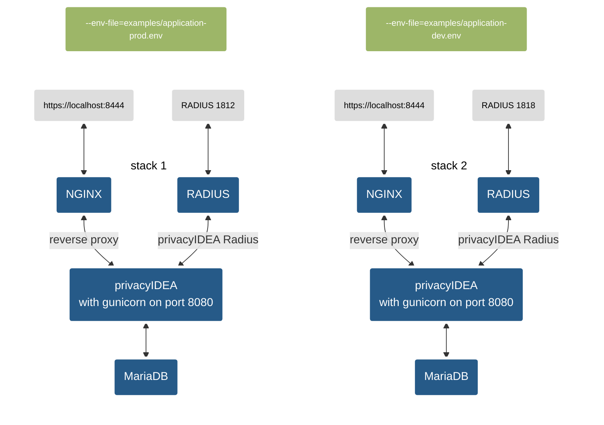

[](https://github.com/gpappsoft/privacyidea-docker/actions/workflows/docker-publish.yml)

# privacyIDEA-docker

Simply deploy and run privacyIDEA instance(s) in a container environment. 

## Overview 
[privacyIDEA](https://github.com/privacyidea/privacyidea) is an open solution for strong two-factor authentication like OTP tokens, SMS, smartphones or SSH keys. 

This project is a complete build environment under linux to run privacyIDEA in a container environment. It uses the official [python](https://pypi.org/project/privacyIDEA/) image and the official [privacyIDEA-Project](https://pypi.org/project/privacyIDEA/)  from PyPi. The image uses [gunicorn](https://gunicorn.org/) to run the app. 

**The main goals of this project are:**
- Give an idea how to run privacyIDEA in a container.
- Build and run the container image simple and fast.
- Deploy different versions and/or stages (e.g. production, staging, devel ...) with the same or different configuration on the same host.
- Deploy a "full-stack" (e.g. privacyIDEA, radius, database and reverse proxy).
- Small footprint: Keep the container image simple and slim ( image is ~374 MB ).
- No changes on the original privacyIDEA code and as less as possible additional scripts inside the image to run the container. Only an *entrypoint.sh-* and a *healthcheck.py-* file is used.

**What this project is not:**
- A fully tested and "production ready" installation of privacyIDEA for *your* container environment.
- A possible way to ignore the [privacyIDEA Documentation](https://privacyidea.readthedocs.io/en/latest/)
- A guide how to use docker
- The "one and only" or "best" method to run privacyIDEA in a container.
- Finished ;)

> [!Note] 
> The image does **not include** a reverse proxy or a database backend. Running the default image as a standalone container uses gunicorn and a sqlite database. This is not suitable for a production environment.
>
> A more 'real world' scenario, which is often used is described in the [Compose a privacyIDEA stack](#compose-a-privacyidea-stack) section.
>
> Also check the [Security considerations](#security-considerations) before running the image or stack in a production environment.

While decoupling the privacyIDEA image from dependencies like Nginx, Apache or a database vendors, a complete stack gives all possibilities to run privacyIDEA with your favorite components.

If you prefer another approach or would like to test another solution, take a look at the [Khalibre / privacyidea-docker](https://github.com/Khalibre/privacyidea-docker) project. This project might be a more suitable solution for your needs.

### Repository 

| Directory | Description |
|-----------|-------------|
| *conf* | contains *pi.cfg* file which is included into the image build process.|
| *secrets* | contains the secrets for docker compose - this project tries to avoid using env-vars for sensitive data (e.g. passwords)|
| *examples* | contains different example-environment files for a whole stack via docker compose|
|*ssl* | contains ssl certificates for the reverse-proxy. Replace it with your own certificate and key file. Use PEM-Format without passphrase. *.pfx is not supported|
|*templates*| contains files used for different services (e.g. niginx, radius ...)|

### Images
Sample images from this project can be found here: 
| registry | repository |
|----------|------------|
| [docker.io](https://hub.docker.com/r/gpappsoft/privacyidea-docker)|```docker pull gpappsoft/privacyidea-docker:latest```
| [ghcr.io](https://github.com/gpappsoft/privacyidea-docker/pkgs/container/privacyidea-docker)| ```docker pull ghcr.io/gpappsoft/privacyidea-docker:latest```|

> [!Note] 
> ```latest``` tagged image is maybe a pre- or development-release. Please use a  release number (like ```3.9.1```) 


### Prerequisites

- Installed container runtime engine (e.g. docker / podman).
- Installed [BuildKit](https://docs.docker.com/build/buildkit/) with buildx and [Compose V2](https://docs.docker.com/compose/install/linux/) (docker-compose-v2) component
- The repository is tested with [Docker](https://docker.com) version 24.0.7 running under Debian 12 and Ubuntu 22.04.3 LTS running Docker version 24.0.5
- Images can be run with [Podman](https://podman.io). It may also run with [podman-compose](https://github.com/containers/podman-compose). 

## Quickstart

#### Quick & Dirty

```
docker pull docker.io/gpappsoft/privacyidea-docker:3.9.1
docker run -d --name privacyidea-docker\
            -e PI_REGISTRY_CLASS=null\
            -e PI_BOOTSTRAP=true\
            -e PI_PEPPER=superSecret\
            -e PI_SECRET=superSecret\
			-v pi-pilog:/var/log/privacyidea:rw,Z\
			-v pi-piconfig:/etc/privacyidea:rw,Z\
			-p 8080:8080\
			gpappsoft/privacyidea-docker:3.9.1
```
WebUI: http://localhost:8080\
user/password: admin / admin

#### Preferred way

To build an run a simple local privacyIDEA container (standalone with sqlite):

```
git clone https://github.com/gpappsoft/privacyidea-docker.git
cd privacyidea-docker
make cert secret build run
....
```

Answer the following question with y:
```
Warning! Overwrite ALL SECRETS  in ./secrets directory: Are you sure? [y/N] y
```

##### Accessing the Web-UI:
Use https://localhost:8080

Default admin username: **admin** 

Default admin password is stored in *./secrets/pi_admin_pass*


## Building and running image

You can use ```Makefile``` targets to build different image versions of privacyIDEA
#### Build a specific privacyIDEA version
```
make build PI_VERSION=3.8.1
```

#### Push to a registry
Use ```make push [REGISTRY=<registry>]```to tag and push the image[^1]
##### Example 
Push image to local registry on port 5000[^2]

```
make push REGISTRY=localhost:5000
``` 
[^1]: If you push to external registries, you may have to login first.
[^2]: You can run your own local registry with:
   ``` docker  run -d -p 5000:5000 --name registry registry:2.7 ```
   
#### Remove the container:
```
make clean
```
You can start the container with the same database (sqlite) and configuration, use ```make run``` again without bootstrapping the instance.
#### Remove the container including volumes:
```
make distclean
```
&#9432; This will wipe the whole container including the volumes!

### Overview targets

| target | description | example
---------|-------------|---------
| ```build ``` | Build an image. Optional specify the version| ```make build PI_VERSION=3.9.1```|
| ```push``` | Tag and push image to registry. Optional with registry uri. Defaults to localhost:5000| ```make push REGISTRY=github.com/gpappsoft/privacyidea-docker/pkgs/container/privacyidea```|
| ```run``` | Run a standalone container with gunicorn and sqlite on port 8080. Optional change prefix tag of the container name. Defaults to *pi*| ```make run TAG=prod```|
| ```secret``` | Generate and **override** secrets in *./secrets* | ```make secret```|
| ```cert``` | Generate and **override** a self-signed certificate for reverse proxy container in *./ssl* | ```make secret```|
| ```clean``` | Remove container and network without removing the named volumes. Optional change prefix tag of the conatiner name. Defaults to *pi* | ```make clean TAG=prod```|
| ```distclean``` | Remove container, network **and remove the named volumes**. Optional change prefix tag of the container name. Defaults to *pi* | ```make distclean TAG=prod```|

> [!Important] 
> This is a simple standalone container which is not production ready. For a more like 'production ready' instance please refer to the next section.

## Compose a privacyIDEA stack

By using docker compose you can easy deploy a customized privacyIDEA instance including Nginx as reverse-proxy and MariaDB as a database backend.

With the use of different environment files for different full-stacks,  you can deploy and run multiple stacks at the same time on different ports. Find *.env files in the *examples* directory.


> [!Note]
> The RADIUS container is not included in this repository at the moment. The freeradius container image including the [privacyIDEA RADIUS-plugin](https://github.com/privacyidea/FreeRADIUS) will be released soon.

### Examples:

Run a stack with project name **prod** and environment variables files from *examples/application-prod.env*

```
  $ make cert secret  #run only once
  $ PI_BOOTSTRAP=true docker compose --env-file=examples/application-prod.env -p prod up
```

Shutdown stack with project name *prod* and **remove** all resources (e.g. container,networks ect.) expect the volumes

```
docker compose -p prod down 
```

You can start the stack in the background. Use **-d** to detach the console

```
  $ PI_BOOTSTRAP=true docker compose --env-file=examples/application-prod.env -p prod -d up
```

Now you can deploy additional container like OpenLDAP for user realms or Owncloud as a client to test 2fa authentication. 

Have fun!

> [!IMPORTANT] 
>- Volumes will not be deleted. You have to take care by yourself.
>- Currently same secrets from *./secrets/* are used for every stack. Future releases will change this behaviour.
>- Delete */etc/privacyidea/BOOTSTRAP* file **inside* the privacyIDEA container, if you want to bootstrap again. This will not delete an existing database!
>- Compose takes some time because of healthchecks.


## Environment Variables

### privacyIDEA
| Variable | Default | Description
|-----|---------|-------------
```ENVIRONMENT``` | examples/application-prod.env | Used to set the correct environment file (env_file) in the docker compose which are used by the container. Use relative filename here.
```PI_VERSION```|3.9.1| Set the used image version
```PI_BOOTSTRAP``` | false | Set to ```true``` to create database tables on the first start of the container. If you need to re-run then you have to delete */etc/privacyidea/BOOTSTRAP* file inside the container. 
```PI_UPDATE```| false | Set to ```true``` to run the database schema upgrade script in case of a new privacyIDEA version. 
```PI_PASSWORD```|admin| don't use this for productive environments. Use secrets with docker compose / docker swarm instead. See [Security considerations](#security-considerations) for more information.
```PI_ADMIN```|admin| login name of the initial administrator
```PI_PORT```|8080| Port used by gunicorn. Don't use this directly in productive environments. Use a reverse proxy..
```LOGLEVEL```|INFO| Debug level in uppercase (e.g. DEBUG, INFO, WARNING ect.). See privacyIDEA documentation for more information about logging.
```SUPERUSER_REALM```|"admin,helpdesk"| Admin realms which can be used for policies in privacyIDEA. privacyIDEA documentation for more information.
```PI_SQLALCHEMY_ENGINE_OPTIONS```| False | Set pool_pre_ping option. Set to ```True``` for DB cluster (like Galera).
```PI_PEPPER``` |superSecret | Used for ```PI_PEPPER``` in pi.cfg. Use `make secrets` to generate new secrets. See [Security considerations](#security-considerations) for more information.
```SECRET_KEY``` | superSecret | Used for ```SECRET_KEY``` in pi.cfg. Use `make secrets` to generate new secrets. See [Security considerations](#security-considerations) for more information.

### DB connection parameters
| Variable | Description
|-----|-------------
```DB_HOST```| Database host
```DB_PORT```| Database port
```DB_NAME```| Database name
```DB_USER```| Database user
```DB_API```| Database driver (e.g. ```mysql+pymysql```)
```DB_EXTRA_PARAM```| Extra parameter (e.g. ```"?charset=utf8"```)


### Reverse proxy parameters
| Variable | Default | Description
|-----|---------|-------------
```PROXY_PORT```| 8443 | Exposed HTTPS port
```PROXY_SERVERNAME```| localhost | Set reverse proxy servername. Shoudl be th common name from the certificate.

### Secrets used by docker compose located in *./secrets/*
| Filename | Default | Description
|-----|---------|-------------
| *db_password*| superSecret | The database password. 
| *db_admin_pass*| admin | The password for the initial admin. 
| *pi_pepper*| superSecret | The PI_PEPPER secret for pi.cfg
| *pi_secret*| superSecret | The SECRET_KEY secret for pi.cfg

## Security considerations

#### Secrets 
The current concept of using secrets with files in the *docker-compose.yaml* is a first approach to reduce the risk of using secrets with environment variables. This may changes in future versions.

Different stacks using always the same secrets. This should not be used in production environments. This behaviour will be changed soon...

## Roadmap

#### Customization and scripts

Suppport for [customization](https://privacyidea.readthedocs.io/en/latest/faq/customization.html) and [scripts](https://privacyidea.readthedocs.io/en/latest/eventhandler/scripthandler.html) comming soon.

#### Logging

Support for ```docker logs``` will be implemented.

#### Radius

A first release of a Freeradius image with the privacyIDEA-RADIUS plugin is in progress.


Any feedback are welcome! 

# Disclaimer

This project is my private project doing in my free time. This project is not a project from the NetKnights company. The project uses the open source version of privacyIDEA. There are no official support from NetKnights for this project available.
